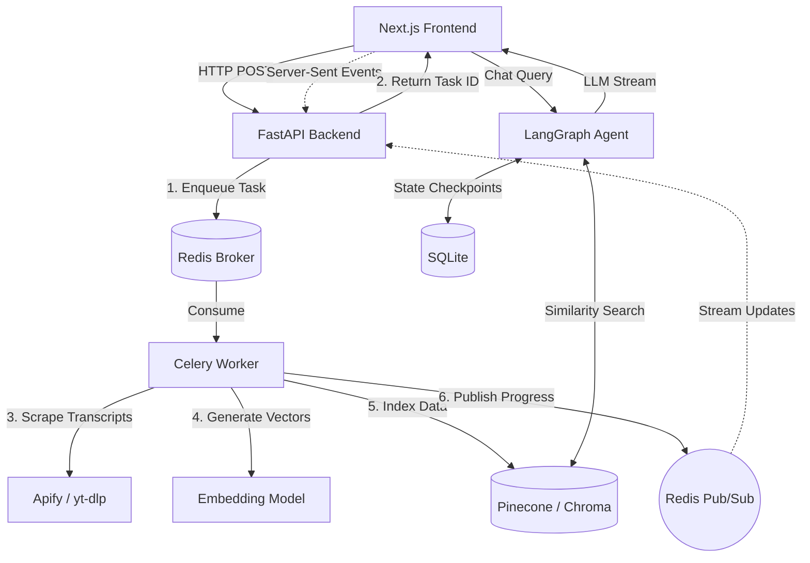

# 🚀 CreatorJoy Replica | AI Social Video Hook Analyzer


A full-stack, event-driven AI application that ingests two social video URLs (YouTube, TikTok, Instagram Reels), scrapes their transcripts, indexes semantic chunks, and provides a **RAG-powered Chat Interface** for users to audit and compare engagement hooks.

Built as a technical showcase demonstrating **production-grade AI orchestration patterns**, fault tolerance, and graceful degradation.

---

## 🏗️ System Architecture

The system utilizes an asynchronous, distributed architecture designed to prevent long-running AI/scraping tasks from blocking the main API thread.



### 🧠 Core Technical Decisions & Patterns

#### 1. Graceful Degradation (Hardware-Aware Embeddings)
To ensure the application never crashes in a restricted environment (e.g., missing API keys), the Vector Store implements a tiered fallback pattern isolated via namespaces:
* **Tier 1:** Google Gemini `gemini-embedding-001` (Preferred)
* **Tier 2:** OpenAI `text-embedding-3-small` (Fallback)
* **Tier 3:** Numpy deterministic mock vectors (Failsafe for CI/CD or local testing without keys)

#### 2. Stateful Agentic Workflows (LangGraph)
Unlike standard stateless LLM wrappers, the Chat interface is powered by a **LangGraph State Machine**. 
* Thread memory is asynchronously persisted to SQLite (`aiosqlite`).
* This allows users to seamlessly resume analysis threads across page reloads without losing LLM context.

#### 3. Real-Time Streaming UI (Server-Sent Events)
WebSockets can be overkill and difficult to load-balance for one-way server-to-client updates. 
* We use **SSE (Server-Sent Events)** piped over a Redis Pub/Sub channel to stream Celery worker progress (scraping, chunking, indexing) and LLM token generation directly to the React Server Components.
* Features a 90-second `AbortController` timeout to gracefully handle upstream LLM API rate limits.

---

## 🚀 Getting Started

### Prerequisites
* Python 3.10+
* Node.js 18+
* Redis (Local or Upstash Serverless)

### 1. Backend Setup
```bash
cd backend
python -m venv venv
source venv/bin/activate  # On Windows: venv\Scripts\activate
pip install -r requirements.txt
```

Create a `.env` file in the `backend` directory:
```env
GOOGLE_API_KEY="your-gemini-key"
REDIS_URL="redis://localhost:6379/0" # Fully supports Upstash rediss:// strings
PINECONE_API_KEY="your-pinecone-key"
```

Start the FastAPI Server and the Celery Worker (in separate terminals):
```bash
# Terminal 1: API Server
uvicorn app.main:app --reload

# Terminal 2: Background Task Worker
celery -A app.worker.celery_app worker --loglevel=info --pool=threads
```

### 2. Frontend Setup
```bash
cd frontend
npm install
npm run dev
```

---

## 🔮 Future Scalability Path

If given a production budget and a 3-month roadmap, I would evolve this architecture by:

1. **User Authentication & Tenant Isolation:** Replacing the `"anonymous"` thread ID fallback with a NextAuth (OAuth) integration, mapping Postgres User UUIDs to Pinecone namespaces to ensure strict data governance.
2. **Async Webhooks vs. Synchronous Workers:** Currently, the Celery worker blocks a thread waiting for the Apify scraper to finish. At scale, this would exhaust the worker pool. I would decouple this by having the scraper hit a `/webhook/scraper-complete` FastAPI route, which would resume the DAG.
3. **Managed State:** Migrating the local `aiosqlite` LangGraph checkpointer to a managed Postgres instance, and local Redis to Upstash/ElastiCache.
4. **Google BatchEmbedContents:** Further optimize vector indexing speeds by utilizing maximum batch sizes for the Google GenAI embedding endpoints. (Note: Initial batching is already implemented).

---

*Designed and engineered as a demonstration of production-grade AI system architecture.*
