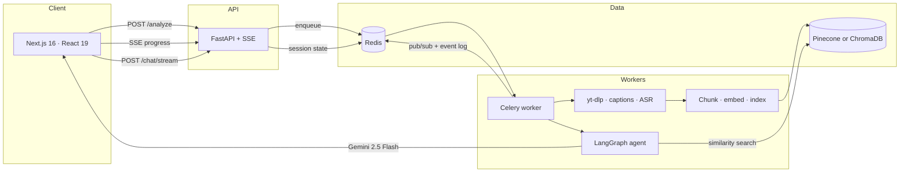

# Intelligent RAG ChatBot for Creators

[](https://github.com/Siva010/Intelligent-RAG-ChatBot-for-creators)
[](backend/tests)
[](https://github.com/Siva010/Intelligent-RAG-ChatBot-for-creators)

**Compare two social videos side by side — transcripts, engagement metrics, and a grounded AI coach that cites what it actually read.**

Built as a portfolio piece: real async workers, retrieval-augmented chat, and the kind of failure handling you want before shipping to paying creators.

---

## Live demo

[](https://intelligent-chatbot-rag.up.railway.app/)

| | |
|---|---|
| **Try the app** | **[https://intelligent-chatbot-rag.up.railway.app/](https://intelligent-chatbot-rag.up.railway.app/)** |
| **Source** | [github.com/Siva010/Intelligent-RAG-ChatBot-for-creators](https://github.com/Siva010/Intelligent-RAG-ChatBot-for-creators) |

> **For reviewers:** Open the link above, paste two public video URLs, and run a comparison. The full stack also runs locally with Docker — see [Getting started](#getting-started).

**Suggested walkthrough (2 minutes):**

1. Paste a **control** YouTube URL and a **competitor** URL (Instagram Reels and TikTok work too).
2. Click **Perform Diagnostic Comparison** and watch progress stream in (scraping → indexing → hook audit).
3. Ask the chatbot something specific, e.g. *“Which video’s hook creates a stronger curiosity loop?”* — answers should cite `[Video A @ MM:SS]` style timestamps when evidence exists.

---

## Why I built this

Creators do not lose on “bad content” alone — they lose on **hooks, pacing, and retention mechanics** that are hard to see when you are staring at one video in isolation.

I wanted a tool that feels like sitting with a sharp script doctor who has already read both transcripts, pulled the numbers, and will not invent quotes. So I built a small product-shaped demo: ingest two URLs, index what was actually said, run an initial hook audit, then let you interrogate the comparison in natural language — with retrieval limited to those two videos.

This is not a thin wrapper around a chat API. Ingestion runs off the request thread, vectors are searchable before you type, and the UI streams long-running work instead of blocking on a spinner.

---

## What you can do today

| Step | What happens |
|------|----------------|
| **1. Paste two URLs** | YouTube, Instagram Reels, or TikTok |
| **2. Background analysis** | Celery worker scrapes metadata + transcripts (parallel), chunks and embeds text, runs an initial hook audit |
| **3. Dashboard** | Side-by-side cards: views, likes, engagement rate, embedded preview, ASR/caption source |
| **4. RAG chat** | Ask about hooks, pacing, CTAs — model retrieves semantic chunks from both videos and cites timestamps |
| **5. Resilience** | Redis-backed session memory, ingest cache, rate-limit aware retries, rule-based fallback if Gemini is throttled |

The nav bar includes a live **backend health** indicator (API + Celery worker).

---

## Architecture (how it fits together)


```mermaid
flowchart LR
  subgraph Client
    UI[Next.js 16 · React 19]
  end

  subgraph API
    FastAPI[FastAPI + SSE]
  end

  subgraph Workers
    Celery[Celery worker]
    Ingest[yt-dlp · captions · ASR]
    RAG[Chunk · embed · index]
    Agent[LangGraph agent]
  end

  subgraph Data
    Redis[(Redis)]
    Vectors[(Pinecone or ChromaDB)]
  end

  UI -->|POST /analyze| FastAPI
  UI -->|SSE progress| FastAPI
  UI -->|POST /chat/stream| FastAPI
  FastAPI -->|enqueue| Redis
  Redis --> Celery
  Celery --> Ingest --> RAG --> Vectors
  Celery --> Agent
  Celery -->|pub/sub + event log| Redis
  FastAPI -->|session state| Redis
  Agent -->|similarity search| Vectors
  Agent -->|Gemini 2.5 Flash| UI
```

**Design choices worth calling out:**

- **Event-driven ingest** — `POST /analyze` returns immediately; progress streams over SSE via Redis Pub/Sub, with events replayed from a Redis list if the client reconnects.
- **LangGraph, not a single prompt** — Separate nodes for system context, hook audit, and conversational RAG; session state persisted in Redis (24h TTL).
- **Tiered vector stack** — Pinecone when configured → local ChromaDB → in-memory keyword fallback so CI and local dev never hard-crash.
- **Tiered embeddings** — Google `gemini-embedding-001` → OpenAI `text-embedding-3-small` → deterministic mock vectors when no API keys are set.
- **Per-user isolation** — Session IDs hash `user_id + url_a + url_b` so two people comparing the same videos do not share chat history (frontend currently sends `anonymous`; ready for auth).
- **Production-minded API** — CORS allowlist, SlowAPI rate limits, shared Redis connection pool for SSE, client disconnect does not kill the Celery job.

---

## Tech stack

| Layer | Technologies |
|-------|----------------|
| **Frontend** | Next.js 16, React 19, Tailwind CSS 4, Recharts, react-markdown, Playwright |
| **API** | FastAPI, SSE (sse-starlette), httpx |
| **Jobs** | Celery 5, Redis (broker, cache, pub/sub, sessions) |
| **AI** | LangGraph, LangChain, Google Gemini 2.5 Flash, `gemini-embedding-001` |
| **Retrieval** | Pinecone (primary), ChromaDB (local fallback) |
| **Ingestion** | yt-dlp, youtube-transcript-api, Apify actors (optional), Gemini/Whisper ASR paths |
| **Ops** | Docker Compose (Redis + API + worker + frontend) |

---

## Getting started

### Prerequisites

- [Docker Desktop](https://www.docker.com/products/docker-desktop/) **or**
- Python 3.10+, Node.js 18+, and a Redis instance (local or [Upstash](https://upstash.com/))

### 1. Environment variables

Create `backend/.env`:

```env
GOOGLE_API_KEY=your_gemini_key          # Required for real AI + preferred embeddings
REDIS_URL=redis://localhost:6379/0      # Supports rediss:// (Upstash)

# Optional but recommended for production-like retrieval
PINECONE_API_KEY=your_pinecone_key
PINECONE_INDEX_NAME=creatorjoy

# Optional fallbacks
OPENAI_API_KEY=                         # Embedding + legacy paths
APIFY_API_TOKEN=                        # Stronger scrape for some IG/TikTok cases

# Production CORS (comma-separated)
# CORS_ORIGINS=https://your-frontend.vercel.app
```

For manual frontend dev, set `frontend/.env.local`:

```env
NEXT_PUBLIC_API_URL=http://127.0.0.1:8000
```

### 2. Run everything with Docker (fastest)

```bash
docker compose up --build
```

- App UI: [http://localhost:3000](http://localhost:3000)  
- API docs: [http://localhost:8000/docs](http://localhost:8000/docs)

### 3. Run without Docker

**Backend** (two terminals):

```bash
cd backend
python -m venv venv
# Windows: venv\Scripts\activate
# macOS/Linux: source venv/bin/activate
pip install -r requirements.txt
uvicorn app.main:app --reload
```

```bash
celery -A app.worker.celery_app worker --loglevel=info --pool=threads
```

**Frontend:**

```bash
cd frontend
npm install
npm run dev
```

---

## Testing & quality

```bash
# Backend — 106 unit/integration tests
cd backend && python -m pytest

# Frontend — Playwright smoke test
cd frontend && npx playwright test
```

Tests cover ingestion edge cases, vector store fallbacks, API contracts, cache behavior, and LangGraph agent helpers — so refactors do not silently break the RAG path.

---

## Project layout

```
├── backend/
│   ├── app/
│   │   ├── main.py              # FastAPI routes, SSE, rate limits
│   │   ├── worker.py            # Celery analyze pipeline
│   │   └── services/
│   │       ├── ingestion.py     # Multi-platform scrape + ASR
│   │       ├── vector_store.py  # Pinecone / Chroma / fallback
│   │       ├── agent.py         # LangGraph RAG + hook audit
│   │       └── cache.py         # Redis video cache
│   └── tests/
├── frontend/
│   ├── src/app/page.tsx         # Main comparison + chat UI
│   └── src/components/          # ChatConsole, AnalyticalHeader, …
└── docker-compose.yml
```

---

## Roadmap & scaling (what I would do next)

Honest next steps if this moved from demo to product:

1. **Auth & multi-tenancy** — NextAuth (or similar), map user UUID → Pinecone namespace / session prefix; remove the `anonymous` default in production.
2. **Webhook-based scraping** — Today the Celery worker waits on Apify/yt-dlp; at scale, push completion to `/webhook/ingest-complete` and resume the graph asynchronously so worker pools are not tied up.
3. **Managed infrastructure** — Redis → Upstash/ElastiCache; sessions → Postgres if audit trails matter; vectors stay on Pinecone with dimension-matched indexes per embedding model.
4. **Observability** — Structured logging, OpenTelemetry traces across API → worker → embedding calls, dashboards for 429/rate-limit spikes (already mitigated with tenacity + UI fallback banner).
5. **Cost controls** — Per-user ingest quotas, transcript length caps, and batch embedding (partially implemented via 100-chunk batches for Gemini).

---

## A note for recruiters & hiring managers

If you only have five minutes:

1. Skim the [architecture diagram](#architecture-how-it-fits-together) above.  
2. Open the **[live demo](https://intelligent-chatbot-rag.up.railway.app/)** (or run `docker compose up --build`).  
3. Glance at `backend/app/services/agent.py` for the LangGraph workflow and grounded citation rules.  
4. Run `pytest` in `backend/` — the test suite is the quickest proof this was engineered, not vibe-coded.

I am happy to walk through tradeoffs (SSE vs WebSockets, Pinecone vs Chroma, why Celery threads on this workload) in an interview.

---

## License

This repository is a technical portfolio project. Add a license file if you plan to open-source contributions.

---

*Built with care for creators who want evidence-backed feedback — not generic AI platitudes.*
